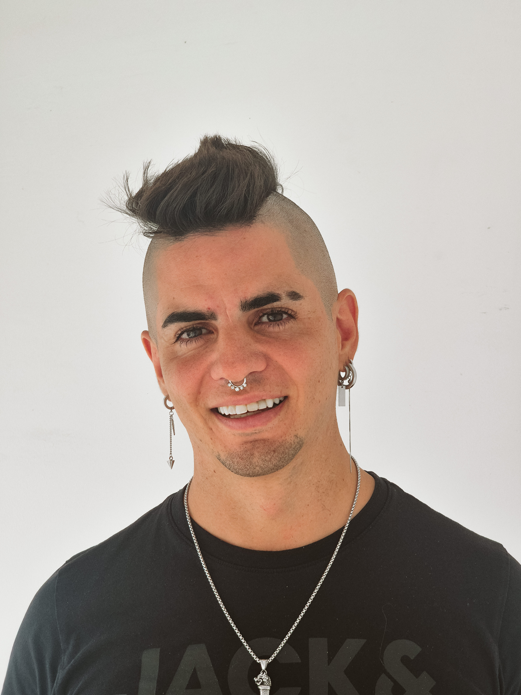

# Germán Küber

<div align="center">
  

  ### Staff Engineer — Systems, AI & Blockchain | Microsoft MVP

  [](https://linkedin.com/in/germankuber)
  [](https://github.com/GermanKuber)
  [](https://youtube.com/@germankuber)
  [](https://germankuber.com)

  📄 **[View HTML](https://germankuber.github.io/resume/resume.html)** | **[Download PDF](https://github.com/germankuber/resume/raw/main/Germ%C3%A1n%20K%C3%BCber.pdf)**
</div>

---

## 👋 About

Microsoft MVP for 8 consecutive years. Founder of Net-Baires, Argentina's largest dev community (100K+ members). 15+ years building systems that move money, ship products, and scale—from low-latency trading (Rust/MEV) to AI platforms (LLM/RAG) to enterprise architectures. Technical leader who builds teams, drives architectural decisions, and represents products on stage—80+ talks at .NET Conf, DevFest, NetCoreConf, vOpen, and more across LATAM & Europe.

---

## 🏆 Key Achievements

- Microsoft MVP — 8 consecutive years
- Net-Baires Founder — 100K+ developer community
- 80+ Technical Talks — .NET Conf, DevFest, vOpen
- $100K+ MEV Profit — Rust pipelines at Borderless
- Kliver Co-Founder — AI training platform, 500+ users
- $50M+ Daily Volume — On-chain monitoring systems

---

## 💼 Work Experience

### Co-Founder & Lead AI Architect
**KliverAI (Own Venture)** | 04/2025 - 04/2026

- Founded and built Kliver—an AI platform that converts expert knowledge into scalable training simulations. Full architecture (Python + .NET + Kubernetes) supporting 500+ users in dynamic roleplay scenarios.
- Implemented low-latency real-time audio pipelines using OpenAI Realtime API and SignalR, achieving <200ms response time for streaming text/audio and event-driven interactions.
- Developed the adaptive simulation engine with LangGraph, including step navigation (H/HH/HHH), success/failure logic, and RAG-powered personalization with 90%+ context relevance.
- Integrated multiple LLM providers (OpenAI, Gemini, Anthropic) with dynamic model routing for cost optimization and performance tuning across different simulation contexts.
- Designed a decentralized marketplace for human evaluation criteria using Zero-Knowledge proofs and blockchain—enabling privacy-preserving, verifiable expert judgment at scale.
- Built a Chrome Extension for real-time meeting capture (Google Meet), streaming transcripts to Kliver's analysis pipeline for automated performance evaluation.

### Fractional CTO (Part-time)
**Rocking Product** | 04/2025 - 11/2025

- Led and restructured a team of 8 engineers, redefining roles, processes, and delivery workflows—improving delivery velocity and overall code quality.
- Collaborated directly with clients to define product requirements and roadmap priorities, bridging technical constraints with business decisions.
- Shipped multiple AI-powered features to production using Python (FastAPI, LangChain), establishing engineering best practices and CI/CD workflows across the team.
- Implemented AI-driven development workflows with autonomous agents automating code review, testing, deploys, and monitoring—significantly reducing manual overhead.
- Optimized LLM usage and cloud infrastructure through model selection, prompt efficiency, and caching strategies—reducing API and cloud spend by 45%+.
- Proposed and led full stack migration from JavaScript to .NET, modernizing the architecture for long-term scalability and team productivity.

### Lead Software Engineer
**Borderless Capital / CTF. Capital** | 08/2021 - 04/2025

- Designed and implemented high-performance MEV searcher pipelines in Rust and Python/Cython for both EVM and Solana, generating $100K+ annual profit with <10ms execution latency through custom networking and parallel transaction broadcasting.
- Built custom transaction delivery systems (RPC + direct validator/TPU routes), achieving sub-slot execution (~400ms) and improving inclusion probability by 35% under heavy mempool competition.
- Developed strategy logic including liquidation detection, multi-hop arbitrage across 5+ DEXs, and cross-chain flow modeling—monitoring $50M+ daily on-chain volume and processing 10K+ opportunities/day.
- Implemented low-latency monitoring and analytics using Prometheus + custom Rust telemetry, tracking 50+ metrics in real-time for slot timing, validator rotation, and execution performance.
- Conducted research and proof-of-concept development on zero-knowledge technologies and L2 ecosystems (StarkNet, ZK circuits, account abstraction), evaluating their applicability for internal MEV tooling and next-generation blockchain products.
- Deep-dived into Geth (Go-Ethereum) codebase using Go, debugging and reverse-engineering EVM internals to optimize transaction simulation and gas estimation accuracy.

### Sr. Software Architect (Front-End / Back-End)
**Paramo Technology** | 08/2020 - 08/2021

- Led all architecture decisions for a large-scale online casino platform, defining core systems, services, and technical standards across the organization.
- Conducted technical interviews and built high-performance engineering teams aligned with the company's product and scalability needs.
- Organized and delivered internal training sessions to upskill developers, establish best practices, and improve engineering consistency.
- Collaborated across all departments to align product, engineering, and infrastructure requirements, ensuring reliable and scalable platform growth.

### Software Architect (Front-End / Back-End)
**CloudX** | 08/2017 - 08/2020

- Designed scalable Angular/React solutions and reusable UI components, leading architecture decisions across multiple product lines.
- Implemented microservices-based backend architecture and domain-driven designs to support high-availability enterprise applications.
- Delivered technical training and conference talks for partners and internal teams, improving engineering practices and cross-team alignment.
- Collaborated directly with clients through on-site visits, gathering requirements, refining product roadmaps, and ensuring successful technical adoption.

### Software Architect (Angular / .NET)
**Majestic Hotel Group** | 01/2014 - 08/2017

- Estimated tasks and developed full-stack features using Angular and .NET for internal hotel management applications.
- Led the migration from AngularJS to Angular 4, improving maintainability, performance, and code consistency across the platform.
- Redesigned the data model and refactored backend workflows toward an event-oriented architecture, reducing coupling and simplifying integrations.
- Defined and documented backend and frontend development processes to streamline deployments and team collaboration.

### .Net Web Developer
**Plus54** | 08/2009 - 03/2014

- Developed .NET web applications and internal tools, delivering features across backend and frontend.
- Designed and built early mobile application components, collaborating with senior developers on architecture and UX.
- Integrated external services and APIs, implementing unit tests and ensuring reliable data exchange between systems.

---

## 🛠️ Skills

💻 **Languages:** Rust, Go, C#, TypeScript, Python, Cython

🤖 **AI/ML:** LLM System Design, OpenAI, Anthropic, LangChain, LangGraph, RAG, Prompt Engineering

⛓️ **Blockchain:** MEV, Zero Knowledge, Cryptography, EVM, Solana, Foundry, Hardhat

☁️ **Infrastructure:** Docker, Kubernetes, AWS, Azure, Prometheus

🏗️ **Architecture:** Domain Driven Design, Microservices, Event-Driven Systems

---

## 🎓 Education

**Systems Engineer** - UAI - Universidad Abierta Interamericana

---

## 🎤 Public Speaking

- 80+ technical talks at .NET Conf, DevFest, NetCoreConf, vOpen, Global Azure Bootcamp, and meetups across LATAM & Europe
- Topics: Rust, Blockchain, ZK, .NET, Software Architecture, Design Patterns, AI/LLMs
- Active YouTube channel with technical content and educational videos

---

## 🎭 Performance Arts

- Stage Magic — Member of Círculo Mágico de España, performing live shows with storytelling and misdirection
- Stand-up Comedy — Open mics and comedy nights, developing improvisation under pressure
- Theater & Improv — 10+ years performing live, applied to team facilitation and high-stakes communication
- Hypnosis & Mentalism — Studying suggestion, non-verbal communication, and audience psychology

---

## 🔧 Build

```bash
npm install
npm run build    # Generate PDF + README
npm run pdf      # Generate PDF only
npm run readme   # Generate README only
```

---

<div align="center">
  <sub>⚡ Auto-generated from <a href="resume.html">resume.html</a></sub>
</div>
